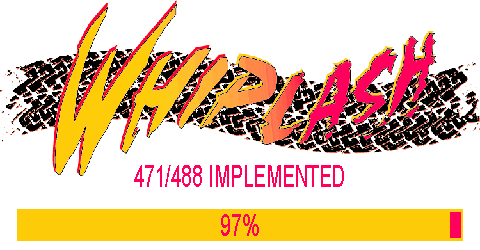

# ROLLER


This project aims to implement all the functionality of the 1995 game Whiplash/Fatal Racing in a way that builds and runs on modern PCs. Where necessary, DOS-specific functions are substituted with SDL and Windows/Unix equivalents.

[](https://www.youtube.com/watch?v=xjQ-uQNEEpM)

## TODO
* Finish decompiling replay functionality
* Integrate looped and pitched sounds (engine sounds) with SDL
* Integrate sound panning with SDL
* Integrate joystick support with SDL
* Improve textured polygon rendering to eliminate flickering polygons
* Bug: WildMidi sometimes locks up the game or crashes when switching songs
* Find instrument/sample set for WildMidi that sounds closer to original hardware
* Bug: pause menu can lock up game
* Bug: pause menu define controls are off by one
* Bug: doubled textures (two adjacent tiles on one quad) do not work
* Bug: race starting position isn't correct
* Bug: some cars start before the green light
* Implement CD audio
* Implement modern networking

## About

Debug symbol dump generated with wdump, part of: https://github.com/open-watcom/open-watcom-v2

Useful tool in generating nice asm output with symbols from wdump applied: https://github.com/fonic/wcdatool

Directions on how to use wcdatool and get remote debugging working with open watcom: https://www.youtube.com/watch?v=bG9tEZOSrQg

Note: wdump symbol offsets do not account for DOS4GW.EXE. Load FATAL.EXE_split_dos4g_payload.exe (FATAL.EXE with DOS4GW.EXE split off, generated by wcdatool) into Ida/Ghidra to have matching symbol offsets.

Hashes of executables used for decomp:

FATAL.EXE
* `md5: 812EEE1404ECDFD87FF765281DF89720`
* `SHA256: 7789768C0A6CDC213EAF7B1AD8CC125531EB3FE7C213ECCAC6188E58F428687E`

FATAL.EXE_split_dos4g_payload.exe
* `md5: 05C2B0730641663133D76DD2CA552B4C`
* `SHA256: A4AD4131DBBFF9884DA4687D8B579B81117E6D23525950D942DF2DF585E2A11E`

## External Dependencies Used:
* SDL3.2.14: https://github.com/libsdl-org/SDL
* SDL_Image3.2.4: https://github.com/libsdl-org/SDL_image
* WildMIDI 0.4.6: https://github.com/Mindwerks/wildmidi

## Installation

Assets from a retail copy of the game are required to run. Drop the contents of the build directory (bin or zig-out) into the Whiplash/Fatal Racing install directory. ROLLER.exe should be in the same directory as WHIP.EXE/FATAL.EXE.

## Build MSVC
1. Clone repository
2. Open ROLLER.sln
3. Build project

## Build GCC
```bash
git clone https://github.com/zizin13/roller.git
cd roller
make
```

### Prerequisites
* SDL3
* SDL3_Image
* WildMIDI

## Build Zig

### Clone the repository

```bash
git clone https://github.com/zizin13/roller.git
cd roller
```

### Install prerequisites

- [Zig 0.14.1](https://ziglang.org/download/)

The easiest way to install is to use [mise](https://mise.jdx.dev/):

```bash
mise install
```
### Build and run the project

Using default settings
```bash
zig build run
```

A custom data folder
```bash
zig build -Dassets-path=/path/to/fatdata run
```

### Windows development

There is basic support for Visual Studio 2022 using [ZigVS](https://marketplace.visualstudio.com/items?itemName=LuckystarStudio.ZigVS)
